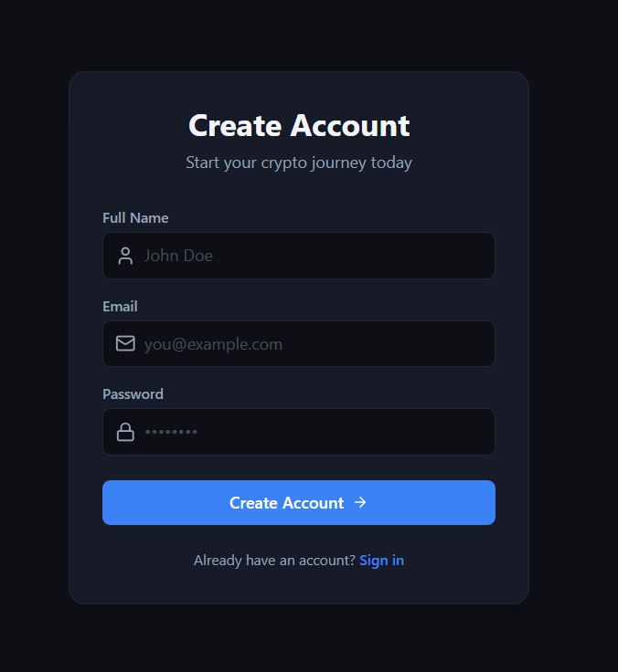
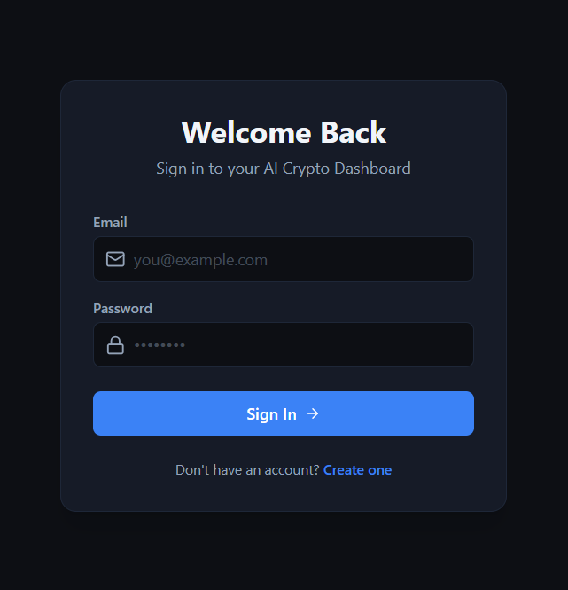
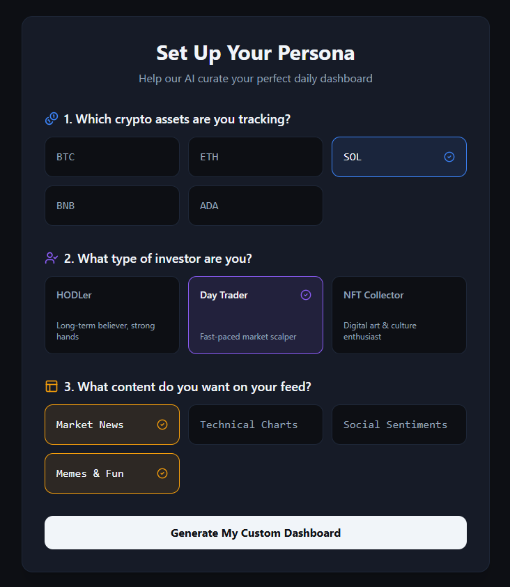
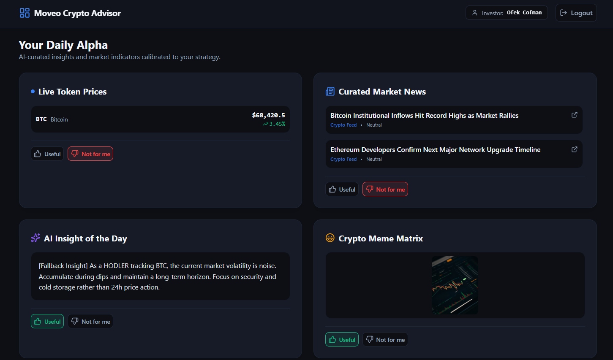

# AI Crypto Advisor

A full-stack, production-deployed application that delivers personalized cryptocurrency insights powered by a live LLM pipeline. Built as a monorepo with a strict separation of concerns, explicit TypeScript throughout, and a hardened API resilience layer that guarantees a non-degraded user experience regardless of external provider availability.

---

## Deployment

| Target | URL |
|---|---|
| **Frontend** | [https://ai-crypto-advisor-frontend-seven.vercel.app](https://ai-crypto-advisor-frontend-seven.vercel.app) |
| **Backend API** | [https://ai-crypto-advisor-production-c0c8.up.railway.app](https://ai-crypto-advisor-production-c0c8.up.railway.app) |
| **Repository** | [https://github.com/ofekcofman98/ai-crypto-advisor](https://github.com/ofekcofman98/AI-Crypto-Advisor) |

---

## Screenshots

The screens below follow the complete user journey from registration through the personalized dashboard.

**Register**



**Login**



**Onboarding — Persona Setup**



**Dashboard — Your Daily Alpha**



---

## Architecture & Monorepo Structure

The project is organized as an **npm workspaces monorepo** with two independently deployable applications under `apps/`.

```
moveo-crypto-advisor/
├── apps/
│   ├── backend/          # Node.js + Express 5 API server
│   └── frontend/         # React 19 + Vite 8 client
├── docs/                 # Architecture specs and pipeline documentation
└── logs/                 # AI interaction log
```

### Backend — `apps/backend`

**Stack:** Node.js, Express 5, TypeScript 6, Prisma v7, PostgreSQL, Zod v4, bcryptjs, jsonwebtoken

The backend follows a **flat, feature-module architecture**. Each domain feature lives in its own directory under `src/modules/` and exposes exactly two files — a router and a service — avoiding unnecessary repository or controller layers.

```
src/
├── config/                      # Validated environment variable parsing
├── modules/
│   ├── auth/
│   │   ├── auth.router.ts       # HTTP boundary: request parsing, Zod validation, response mapping
│   │   ├── auth.service.ts      # Business logic: bcrypt hashing, JWT signing, Prisma queries
│   │   ├── auth.schema.ts       # Zod input schemas
│   │   └── auth.types.ts        # Module-scoped interfaces and DTOs
│   ├── onboarding/
│   ├── dashboard/
│   │   ├── dashboard.router.ts
│   │   ├── dashboard.service.ts # Orchestrates CoinGecko, CryptoPanic, and OpenRouter calls
│   │   ├── ai.service.ts        # LLM integration with cache and rate-limit management
│   │   ├── dashboard.mock.ts    # Static fallback data for all external dependencies
│   │   └── dashboard.constants.ts
│   └── feedback/
├── shared/
│   ├── database/
│   │   └── prismaClient.ts      # Singleton Prisma client (mockable in tests)
│   └── errors/
│       └── AppError.ts          # Typed error class carrying explicit HTTP status codes
├── utils/
│   └── asyncHandler.ts          # Wraps async route handlers, forwards exceptions to global middleware
├── app.ts                       # Middleware stack assembly, route mounting, global error handler
└── server.ts                    # Port binding — excluded from test imports
```

**Execution flow:**

```
HTTP Request
  └── Router (Zod parse, asyncHandler)
        └── Service (business logic, Prisma ORM)
              └── PostgreSQL
```

### Frontend — `apps/frontend`

**Stack:** React 19, Vite 8, TypeScript 6, TanStack Query v5, Zustand v5, React Router v7, Tailwind CSS v4

The frontend uses a **Component-Driven / Fractal architecture**. Data-fetching concerns are fully decoupled from presentation via custom React hooks backed by TanStack Query. Global authentication state is held in a Zustand store; all other server state is managed through the query cache.

```
src/
├── components/       # Reusable UI primitives and layout blocks
├── hooks/            # Custom hooks encapsulating all TanStack Query calls
├── pages/            # Route-level page components (thin — delegate to hooks and components)
├── store/            # Zustand auth store (token + user state)
└── utils/            # Client-side formatters and shared helpers
```

---

## API Resilience & Production Workarounds

### Dynamic CORS Origin Handling

Standard static-string CORS configuration is insufficient for Vercel deployments, where preview environments generate unique subdomain URLs (e.g., `project-git-branch-team.vercel.app`). The application resolves this with a **dynamic origin evaluation function** in `apps/backend/src/app.ts`:

```typescript
const isAllowedOrigin = (origin: string): boolean => {
  if (origin === 'http://localhost:5173') return true;
  if (origin.endsWith('.vercel.app')) return true;
  if (process.env.CLIENT_ORIGIN && origin === process.env.CLIENT_ORIGIN) return true;
  return false;
};

app.use(
  cors({
    origin: (origin, callback) => {
      if (!origin || isAllowedOrigin(origin)) {
        callback(null, true);
      } else {
        callback(new Error(`CORS: origin '${origin}' is not allowed.`));
      }
    },
    credentials: true,
  }),
);
```

This logic permits three origin classes without requiring a full wildcard:

| Class | Rule |
|---|---|
| Local development | Exact match on `http://localhost:5173` |
| All Vercel deployments (production + previews) | Suffix check on `.vercel.app` |
| Explicit production override | Exact match against `CLIENT_ORIGIN` environment variable |
| Server-to-server / `curl` (no `Origin` header) | Passed through unconditionally |

### External Provider Resilience Layer

The system integrates with two external providers — **CoinGecko** (market prices) and **OpenRouter** (LLM completions) — both of which are subject to rate limits and transient downtime. The resilience strategy operates at two levels:

**Level 1 — Service-layer fallback (per provider)**

| Provider | Failure Mode | Fallback Mechanism |
|---|---|---|
| **CoinGecko** | Any HTTP or network error | Returns static `MOCK_PRICE_MAP` records with `isFallback: true` flag set on each token |
| **OpenRouter** | `HTTP 429` rate limit | Parses `retry_after_seconds` from the error metadata and sets an in-process `rateLimitCooldownUntil` timestamp; subsequent requests within the cooldown window bypass the API entirely |
| **OpenRouter** | Missing API key | Immediately returns `getFallbackInsight()` without attempting a network call |
| **OpenRouter** | Any other error or empty response | Logs a warning and returns `getFallbackInsight()` |
| **CryptoPanic** | Any HTTP or network error | Returns static `MOCK_NEWS` array |

**Level 2 — In-memory response cache (`ai.service.ts`)**

Successful LLM responses are cached in a `Map<string, CacheEntry>` keyed on `investorType + sorted asset list`. The TTL is **5 minutes**. Cache hits bypass the OpenRouter API entirely, providing both latency savings and an implicit buffer against quota exhaustion.

```
Request for insight
  └── Check rate-limit cooldown? ──[yes]──> return getFallbackInsight()
        └── Check in-memory cache? ──[hit, not expired]──> return cached insight
              └── Call OpenRouter API
                    ├── Success ──> write to cache, return insight
                    └── 429 / Error ──> set cooldown timestamp, return getFallbackInsight()
```

**Level 3 — Router-layer catch-all (`dashboard.router.ts`)**

Each dashboard endpoint wraps its service call in a secondary `try/catch`. If any service function throws after its own internal fallbacks are exhausted, the router still returns `HTTP 200` with the relevant static mock payload. The client never receives a 5xx response from a dashboard endpoint.

---

## Automated Test Suite

The monorepo features a comprehensive, fully automated testing culture with **174 total tests** executed via Vitest to ensure regression immunity and strict state validation across both applications.

### Backend Test Distribution (`apps/backend`)

The API server ships **28 integration and component tests** executed against the real Express application instance via `supertest`, with all database I/O intercepted through a deep Prisma mock client (`jest-mock-extended`).

| Module | File | Tests | Coverage Areas |
|---|---|---|---|
| **Auth** | `auth.spec.ts` | 3 | Registration success, JWT issuance, Zod validation rejection, bcrypt login |
| **Onboarding** | `onboarding.spec.ts` | 7 | Preference persistence, JWT guard (missing/invalid token), Zod enum validation |
| **Dashboard** | `dashboard.spec.ts` | 9 | Happy paths for all 4 endpoints, resiliency paths (DB failure, service throws), auth guard across all routes |
| **Feedback** | `feedback.spec.ts` | 9 | UP/DOWN vote registration, upsert overwrite semantics, JWT guard, Zod field validation, DB resiliency |
| | | **28** | |

### Frontend Test Distribution (`apps/frontend`)

The client contains **146 component and unit tests** across 15 spec files to guarantee layout stability, interactive UI states, and robust integration with global and asynchronous data states:

| Spec File | Tests | Coverage Areas |
|---|---|---|
| `CoinPricesCard.spec.tsx` | 18 | Live market price grids, token formatting, and sparkline rendering |
| `Card.spec.tsx` | 17 | Core atomic UI primitive states, variants, and children slot rendering |
| `MarketNewsCard.spec.tsx` | 16 | CryptoPanic RSS news feed integration, layout grids, and external links |
| `MemeCard.spec.tsx` | 13 | Fun community features, image loading states, and responsive styling |
| `RouteGuards.spec.tsx` | 11 | Authentication checks, public/private route bouncing, and token validation |
| `AiInsightCard.spec.tsx` | 11 | LLM prompt streaming layouts, typography handling, and parsing errors |
| `AuthCard.spec.tsx` | 10 | Login/Register shell wrapping, responsive card borders, and sub-headers |
| `VotingButtons.spec.tsx` | 9 | Feedback loop metrics, active UP/DOWN state toggles, and optimistic updates |
| `AuthInput.spec.tsx` | 9 | Interactive validation messaging, password eye toggles, and focus pseudo-states |
| `SelectionGrid.spec.tsx` | 9 | Grid selection matrix, multi-asset selecting limits, and keyboard navigation |
| `Register.spec.tsx` | 6 | Sign-up field validation submission logic and clean error state rendering |
| `Login.spec.tsx` | 5 | Direct credentials handling, session persistence triggers, and state resets |
| `Dashboard.spec.tsx` | 5 | High-level orchestration layout, multi-card component lifecycle bindings |
| `CardGrid.spec.tsx` | 4 | Layout container responsiveness, column mapping, and loading skeletons |
| `Onboarding.spec.tsx` | 3 | Questionnaire multi-step wizard, tracking step bounds, and submission routing |
| | | **146** | |

### Running the Tests

You can run the test pipeline either globally from the workspace root or by targeting individual applications:

```bash
# Run the entire test suite (All 174 tests across the monorepo)
npm test --workspaces

# Run only Backend tests
npm test --workspace=apps/backend

# Run only Frontend tests
npm test --workspace=apps/frontend
```

> Tests do not require a live database connection or any API keys. All external I/O is intercepted at the Prisma mock and service-mock boundaries.

---

## Internal References

| Document | Location | Description |
|---|---|---|
| **Development Log** | [`logs/ai_interaction_log.md`](logs/ai_interaction_log.md) | Chronological record of every major design decision, implementation choice, and architecture trade-off made during development. The primary artifact for reviewing the engineering process. |
| **LLM Alignment Pipeline** | [`docs/bonus_pipeline.md`](docs/bonus_pipeline.md) | Specification for the feedback-driven LLM training pipeline. Details both the short-term few-shot in-context learning approach (dynamic prompt injection from upvoted insights) and the long-term Direct Preference Optimization (DPO) fine-tuning strategy using collected UP/DOWN vote pairs. |
| **System Architecture** | [`docs/architecture.md`](docs/architecture.md) | Full directory structure, execution flow diagrams, and error handling architecture. |
